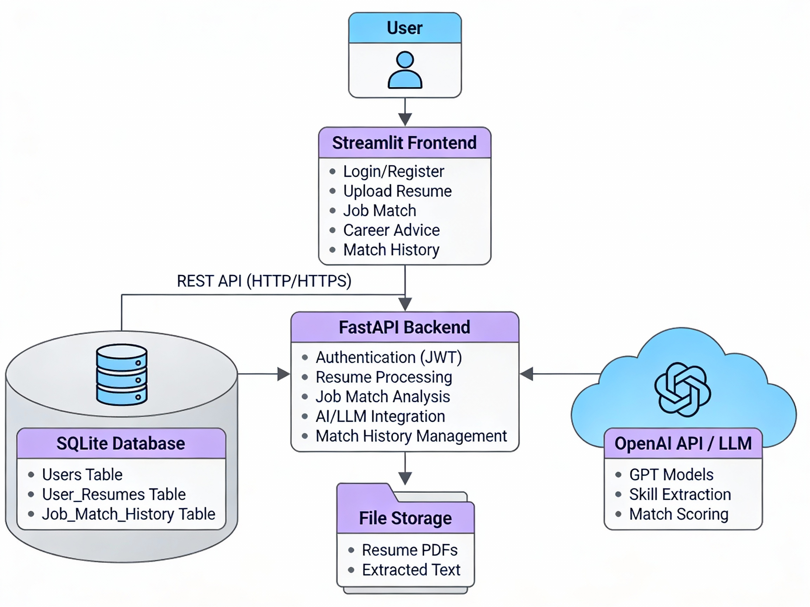

# 🧭 Career Compass

> AI-Powered Job & Career Assistant using GenAI and RAG Architecture

## 📖 Overview

Career Compass is an intelligent career assistant that helps job seekers analyze resumes, match with job descriptions, and receive personalized career advice. Built with FastAPI backend, Groq AI for LLM capabilities, ChromaDB for vector search, and a beautiful Streamlit frontend.

## ✨ Features

- 📄 **Resume Management** - Upload and manage multiple resumes (PDF/DOCX) with automatic text extraction
- 🎯 **Smart Job Matching** - AI-powered resume vs job description analysis with percentage-based match scores
- 🔍 **Skill Gap Analysis** - Identify matched skills and missing skills for target roles
- 💬 **Career AI Assistant** - Get personalized career advice using RAG (Retrieval Augmented Generation)
- 📊 **Match History** - Track and review past job match analyses with detailed breakdowns
- 💭 **Chat History** - Access previous career advice conversations in collapsible format
- 🎮 **Gamified Dashboard** - Career readiness score with achievement tiers (Beginner → Master)
- 🔒 **Secure Authentication** - JWT-based user accounts with bcrypt password encryption
- 🎨 **Modern UI** - Dark theme with glassmorphism effects and smooth animations

## 🛠️ Tech Stack

**Frontend:** Streamlit, Custom CSS  
**Backend:** FastAPI, SQLAlchemy, Uvicorn  
**Database:** SQLite  
**AI/ML:** Groq (LLaMA 3), LangChain, ChromaDB, spaCy  
**Security:** JWT, Passlib (bcrypt)

## 🚀 Quick Start

### Prerequisites
- Python 3.10+
- Groq API Key (free from [console.groq.com](https://console.groq.com))

### 1. 📦 Installation
Clone repository
git clone https://github.com/r-s-pavithra/career-compass.git
cd career-compass

Create virtual environment
python -m venv venv
source venv/bin/activate # Windows: venv\Scripts\activate

Install dependencies
pip install -r requirements.txt
python -m spacy download en_core_web_sm

### 2. ⚙️ Configuration

Create `.env` file:

SECRET_KEY=your-secret-key-here
ACCESS_TOKEN_EXPIRE_MINUTES=60
GROQ_API_KEY=your-groq-api-key
DATABASE_URL=sqlite:///./career_compass.db
**🔑 Get Groq API Key:**
1. Visit [Groq Console](https://console.groq.com/)
2. Sign up for free account (⚡ Fast inference, generous free tier)
3. Generate API key
4. Copy to `.env` file

### 3. ▶️ Run Application

Terminal 1: Start backend
uvicorn app.main:app --reload

Terminal 2: Start frontend
streamlit run frontend.py

🌐 Access the app at `http://localhost:8501`

## 📖 How to Use

1. 📝 **Register/Login** - Create your secure account
2. 📄 **Upload Resume** - Add your PDF/DOCX resume (AI extracts skills automatically)
3. 🎯 **Job Match** - Paste job description and get AI-powered match analysis
4. 💬 **Career Advice** - Ask questions and get personalized guidance
5. 📊 **Track Progress** - View match history and career readiness score

## 🏗️ Project Architecture

The system follows a modern three-tier architecture with AI integration:

## 🔗 API Documentation

Interactive API docs available at:
- 📘 **Swagger UI**: `http://localhost:8000/docs`
- 📗 **ReDoc**: `http://localhost:8000/redoc`

**Key Endpoints:**

**🔐 Authentication**
- `POST /auth/register` - User registration
- `POST /auth/login` - User login with JWT

**📄 Resume Management**
- `POST /upload-resume` - Upload and process resume
- `GET /my-resumes` - List user's resumes
- `DELETE /resumes/{id}` - Delete resume

**🤖 AI Analysis**
- `POST /job-match` - Analyze resume vs job description
- `POST /career-advice` - Get personalized career advice

**📊 History**
- `GET /match-history` - Retrieve job match history
- `GET /chat-history` - Retrieve career advice conversations
- `DELETE /match-history/{id}` - Delete match record
- `DELETE /chat-history/{id}` - Delete chat record

**👤 Account**
- `DELETE /delete-account` - Permanently delete account

## 👨‍💻 Author

**PAVITHRA R S**  
🔗 GitHub: [@r-s-pavithra](https://github.com/r-s-pavithra)  
📧 Email: pavithrasureshbabur@gmail.com
